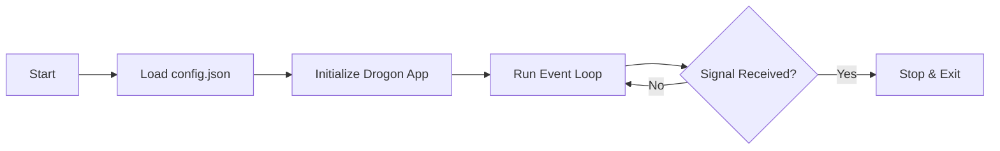
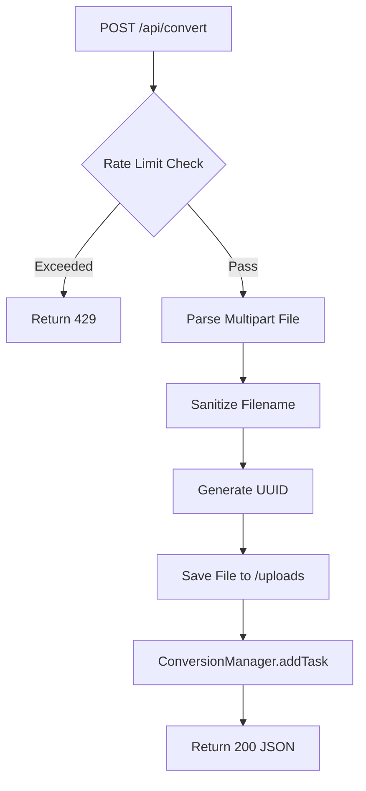
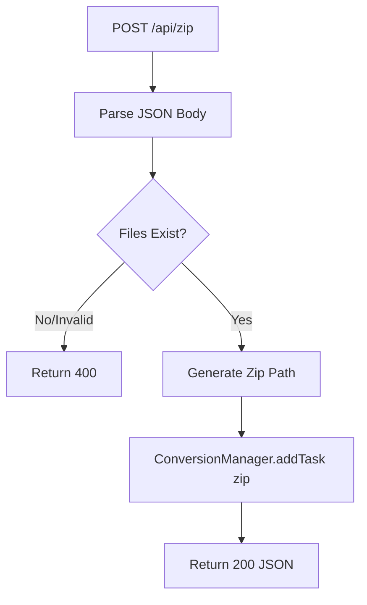
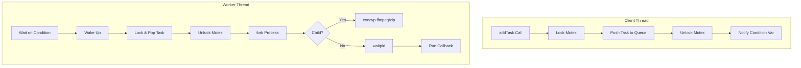
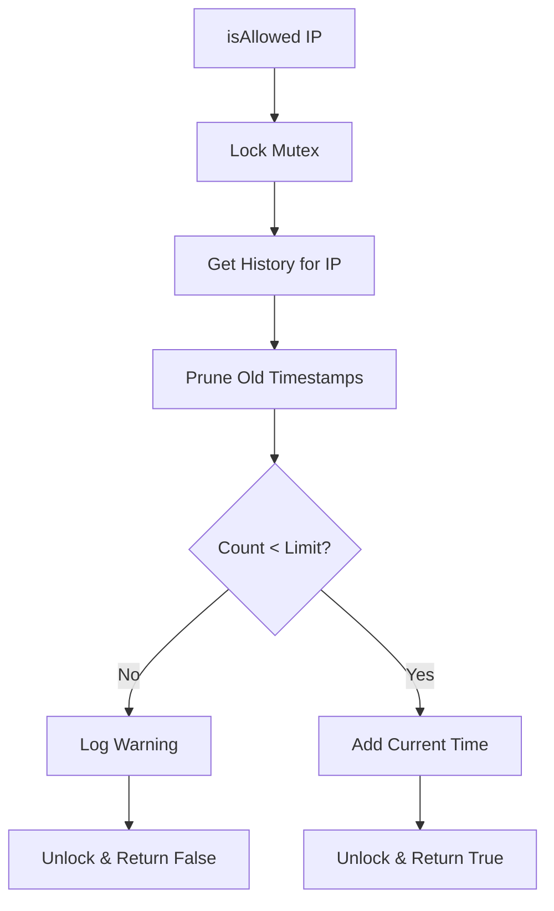

# KConvertor Source Code Guide (v0.1.0)

This document provides a deep dive into the implementation details of the KConvertor source code. It is intended for developers who want to understand, modify, or extend the application.

## 1. Entry Point: `src/main.cc`

The `main` function is the bootstrapper for the application.
- **Config Loading**: It calls `drogon::app().loadConfigFile("config/config.json")`. This implies the application relies heavily on this JSON file for setting up HTTP listeners (ports), concurrency models (thread counts), and limits (keep-alive, max body size).
- **Event Loop**: `drogon::app().run()` starts the non-blocking I/O loop. Access to the `main` function returns only when the application receives a termination signal (SIGINT/SIGTERM).



## 2. Controllers

Controllers handle incoming HTTP traffic. They are defined in `src/controllers/`.

### 2.1 `ConverterController` (`src/controllers/ConverterController.cc`)
 This is the core controller handling business logic.

#### `convert` Method
Handles `POST /api/convert`.
1.  **Rate Limiting**: Immediately checks `RateLimiter::instance().isAllowed(clientIP)`. If false, returns `429 Too Many Requests`. This protects the server from abuse before expensive processing begins.
2.  **Multipart Parsing**: Uses `MultiPartParser` to handle file uploads.
3.  **Security Sanitization**:
    - Generates a UUID for the file to prevent collisions.
    - Strips non-alphanumeric characters from the filename to prevent path traversal or shell injection attacks during later processing.
4.  **Async Processing**: Instead of converting immediately (which would block the HTTP thread), it calls `ConversionManager::instance().addTask(...)`.
5.  **Callback**: Returns a `200 OK` with a JSON payload containing the `download_url` once the async task completes.



#### `createZip` Method
Handles `POST /api/zip`.
1.  **Input Validation**: Expects a JSON body with a `files` array.
2.  **Path Verification**: Iterates through requested filenames and verifies they exist in `./www/downloads/` using `std::filesystem::exists()`. It deliberately ignores directory components in the input to enforce a "jail" in the downloads folder.
3.  **Command Construction**: Builds a command vector `{"zip", "-j", "-q", output_zip, input_files...}`.
4.  **Execution**: Offloads the zip command to `ConversionManager` to prevent blocking.



## 3. Services

Services handle background processing and shared state. Defined in `src/services/`.

### 3.1 `ConversionManager` (`src/services/ConversionManager.cc`)
A Singleton service implementing a Thread Pool pattern.

- **Task Queue**: Stores `ConversionTask` objects (command args + callback) in a `std::queue`. Protected by `std::mutex queueMutex_`.
- **Worker Threads**:
    - Created in the constructor based on `std::thread::hardware_concurrency()`.
    - Each thread runs an infinite loop waiting on `condition_variable`.
    - **Secure Execution**: Uses `fork()` and `execvp()` to run FFmpeg/Zip.
        - *Why not `system()`?* `system()` spawns a shell (`/bin/sh -c`), which is vulnerable to injection if filename sanitization fails. `execvp` passes arguments directly to the executable, bypassing the shell entirely.
- **Cleanup**: Runs a dedicated thread to periodically remove old files from `./uploads` and `./www/downloads` (logic in `cleanupLoop`).



### 3.2 `RateLimiter` (`src/services/RateLimiter.cc`)
A thread-safe singleton managing request quotas.

- **Sliding Window**: Uses a `std::deque<chrono::time_point>` to store timestamps for each IP.
- **Logic**:
    1.  On a new request, prune timestamps older than `TIME_WINDOW` (1 hour).
    2.  Check if remaining count < `MAX_REQUESTS` (10).
    3.  If yes, add new timestamp and return `true`.
    4.  If no, return `false`.
- **Memory Management**: Includes a `cleanupStaleEntries` method to remove IPs that haven't made requests recently, preventing the `std::unordered_map` from growing indefinitely.



## 4. Frontend Code (`www/app.js`)

The client-side logic is vanilla JavaScript.
- **`uploadAndConvert`**:
    - Iterates through selected files.
    - Uses `fetch` with `FormData` to hit `/api/convert`.
    - Updates a progress bar element.
- **Download Logic**:
    - Stores resulting URLs in an array `downloadUrls`.
    - If `downloadUrls.length > 1`, ensures the "Download All" button calls `/api/zip` to generate a package.

## Author & License

**Author**: Kyaw Tun Linn ([GitHub](https://github.com/KyawTunLinn))

**License**: GPL-2.0

```
Copyright (C) 2026 Kyaw Tun Linn
```
