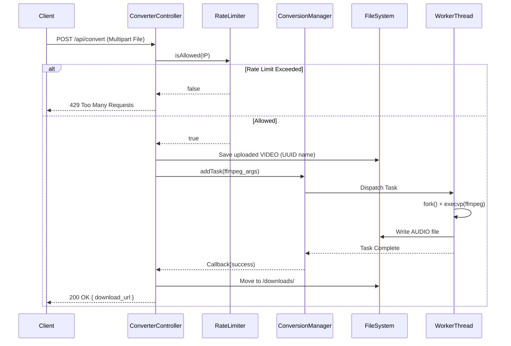
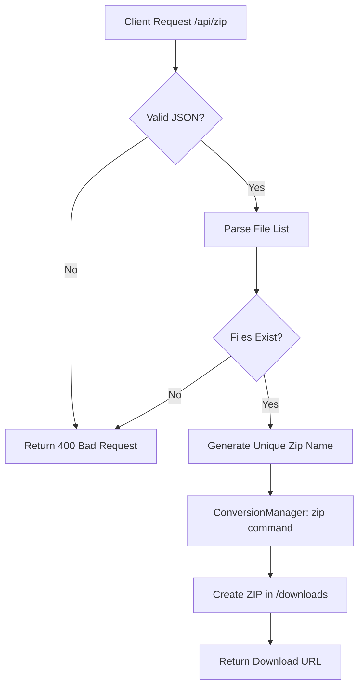

# KConvertor System Design Document (v0.1.0)

## 1. System Overview
KConvertor is a high-performance, asynchronous C++ web service designed for converting video files to various audio formats. It utilizes the **Drogon** web framework for handling HTTP requests and **FFmpeg** for media processing. The system is architected to handle concurrent conversions efficiently without blocking the main event loop, ensuring responsiveness even under load.

### Key Features
- **Asynchronous Processing**: Non-blocking I/O for file uploads and conversion tasks.
- **Queue Management**: Specialized task queue for managing FFmpeg subprocesses.
- **Resource Protection**: Rate limiting and UUID-based file isolation.
- **Secure Execution**: Direct `fork/exec` implementation to prevent shell injection.

## 2. Architecture Components

### 2.1 Web Layer (Drogon Framework)
- **HttpController**: Routes HTTP requests to appropriate handlers.
    - `ConverterController`: Handles file uploads (`/api/convert`) and batch zip requests (`/api/zip`).
    - `StaticFileController`: Serves the frontend (HTML/JS/CSS).
    - `StatsController`: Provides system metrics.

### 2.2 Service Layer
- **ConversionManager**: A singleton service managing a thread pool of worker threads. It pulls tasks from a thread-safe queue and executes FFmpeg commands securely.
- **RateLimiter**: Tracks request frequency per IP address using a sliding window algorithm to prevent abuse.

### 2.3 Storage Layer
- **Local Filesystem**: 
    - `./uploads/`: Temporary storage for uploaded raw video files.
    - `./www/downloads/`: Storage for converted audio files and generated ZIP archives.

## 3. Operation Flow

### 3.1 File Conversion Flow
The following sequence diagram illustrates the lifecycle of a conversion request:



### 3.2 Batch Download Flow (ZIP)



## 4. Operational Details

### Startup Phase
1. **Config Loading**: The application loads `config/config.json` to configure listeners (port 8080), thread counts, and upload limits.
2. **Service Initialization**:
    - `ConversionManager` starts a thread pool sized to the number of CPU cores.
    - `RateLimiter` initializes its memory structures.
3. **Event Loop**: Drogon starts the main IO event loop to accept connections.

### Request Handling
- **Uploads**: handled by `MultiPartParser`. Large files are streamed to disk to minimize memory usage.
- **Security**:
    - **Input Sanitization**: Filenames are stripped of special characters.
    - **Process Isolation**: External commands are executed using `execvp`, avoiding shell interpretation.
- **Cleanup**: `RateLimiter` periodically cleans up stale IP records. `ConversionManager` has a background thread (planned/implemented) to clean up old files from `uploads` and `downloads`.

### Concurrency Model
- **Non-Blocking**: The main thread handles HTTP traffic.
- **Worker Pool**: CPU-intensive tasks (FFmpeg, Zip) are offloaded to `ConversionManager` workers.
- **Synchronization**: 
    - `std::mutex` protects the shared task queue.
    - `std::atomic` tracks global statistics.
    - UUIDs ensure file operations do not collide, removing the need for global file locks.

## 5. Author & License

**Author**: Kyaw Tun Linn ([GitHub](https://github.com/KyawTunLinn))

**License**: GNU General Public License v2.0 (GPL-2.0)

```
Copyright (C) 2026 Kyaw Tun Linn
This program is free software; you can redistribute it and/or modify it under the terms of the GNU General Public License as published by the Free Software Foundation; either version 2 of the License, or (at your option) any later version.
```
